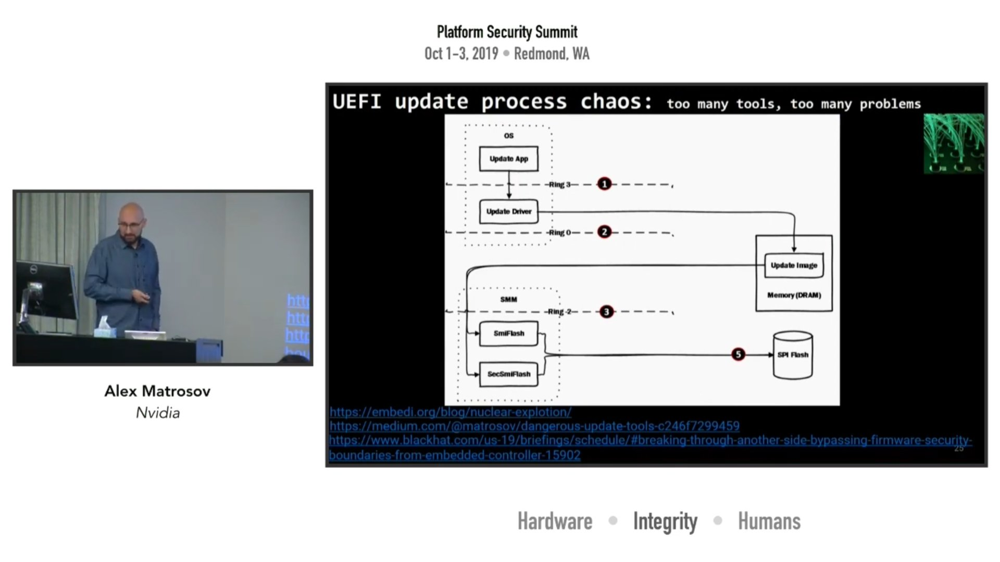
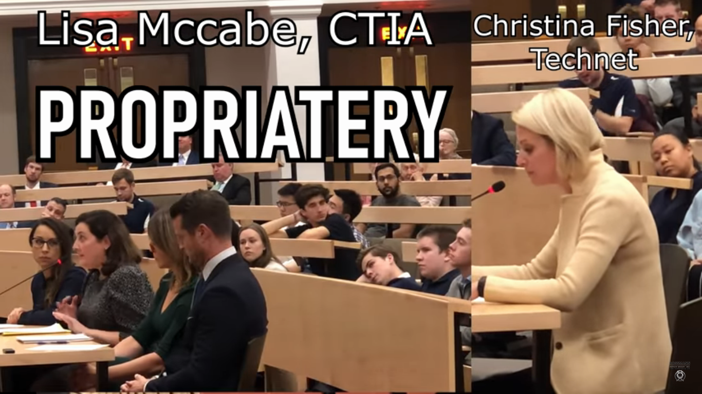
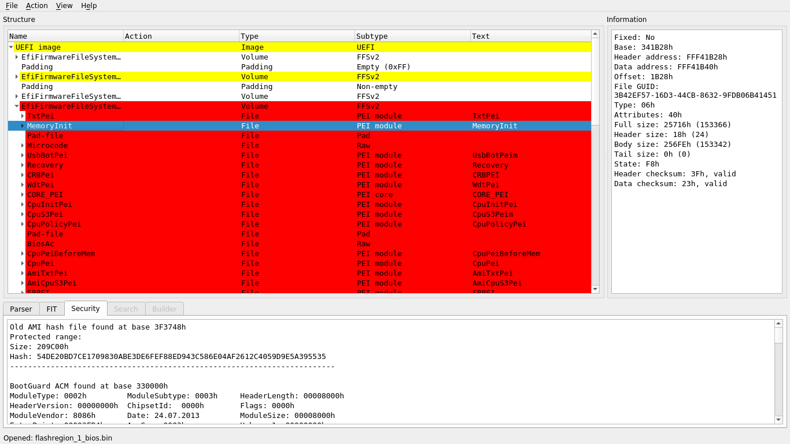
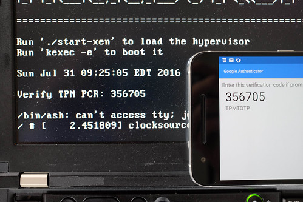

## Agenda

- Motivation
- LinuxBoot Concept
- UEFI Integration
- Implementations
- Future Work

# Motivation

## Firmware now vs back then

- 1999: birth of coreboot as LinuxBIOS
  * open source x86 firmware \\o/
- 2004: Tiano initial release by Intel
  * now EDK I/II, maintained by UEFI community
- 2014: Intel Haswell release
  * requires proprietary [MRC (Memory Reference Code) binary](https://doc.coreboot.org/northbridge/intel/haswell/mrc.bin.html)
  * later on: [FSP (Firmware Support Package)](https://www.intel.com/content/dam/www/public/us/en/documents/product-briefs/firmware-support-package-brief.pdf)
- 2014: AMD Generic Encapsulated Software Architecture (AGESA) lockdown
  * [binary only since then](https://mail.coreboot.org/pipermail/coreboot/2014-November/078892.html)
  * was initially open sourced for coreboot in early 2011
  * an [open laptop](http://openlunchbox.com/open-laptop/) would have been nice
- 2019: [UDF (UEFI Dumpster Fire™)](https://twitter.com/xjamesmorris/status/1179825267939786752)
  * [criticized by many people](https://altelectron.org.uk/notice/9hJJFGA7fbQAAcQJWa)
  * [for many years](http://allsoftwaresucks.blogspot.com/2013/04/uefi-and-arm.html)

### neglected: Intel ME, AMD PSP, ARM and other SoCs

## State of security

{ width=80% }

- update processes are often insecure
- vendors and firmware projects take no responsibility
- great summary by [Alex Matrosov](https://www.youtube.com/watch?v=gsp1cCR7oOY)

## Right to repair bill

{ width=80% }

- [vendors still propose security by obscurity](https://www.youtube.com/watch?v=W47nB65zcmk)
  * although known to be pointless against sophisticated attackers
- repair technicians suffer from propretiary information
  * consumers and researchers alike

## Platform Initialization (PI)


### basic [platform initialization](https://www.cs.cmu.edu/~410/doc/minimal_boot.pdf): CPU, chipset, RAM (PEI / romstage)
- has to be rerun [similarly for S3 resume](https://reverse.put.as/2015/07/01/reversing-prince-harmings-kiss-of-death/)

# LinuxBoot Concept

## LinuxBoot

{ height=25% }

- Linux kernel + initramfs in SPI flash
- can run on top of
  * coreboot: as payload
  * U-Boot
  * vendor UEFI firmware: remove DXEs, build Linux with EFI support

\(=>\) approach rather than implementation

## Integrations


## Constraints

- only few megabytes of space (8 to 16 common)
- build minimum kernel
  * disk drivers
  * filesystems
  * possibly networking
- build basic initramfs
  * core utilities like `ls`, `cat`, etc
  * bootloader(s) - need to boot an OS ;)

\(=>\) very similar to OpenWrt, except for bootloader instead of routing tools

# UEFI Integration

## [UEFI binary format](https://wiki.osdev.org/UEFI#Binary_Format)

[PE32 / PE32+ format](https://docs.microsoft.com/en-us/windows/win32/debug/pe-format), without symbol tables

Three types:

- applications
  * OS loaders
  * utilities
- boot service drivers
  * disk drivers
  * network drivers
- runtime drivers
  * may remain loaded while OS is running

\(=>\) replace applications and boot service drivers with LinuxBoot

## Tools

- [Fiano](https://github.com/linuxboot/fiano)
  * utk with [DXE cleaner](https://github.com/linuxboot/fiano#dxe-cleaner)
- [UEFITool](https://github.com/LongSoft/UEFITool)

{ width=80% }

# Implementations

## [u-root](https://u-root.tk/)

{ height=25% }

- initramfs tool written in Go
- utilities like busybox (`ls`, `cat`, ...)
- offers bootloaders (SystemBoot)

## Try out u-root in QEMU

```sh
go get github.com/u-root/u-root
# build an initramfs
GOOS=linux \
  ~/go/bin/u-root -build=bb -o /tmp/initramfs.linux_amd64.cpio
# get a kernel
MIRROR="http://mirror.rackspace.com" REL="2019.10.01" \
  wget "$MIRROR/archlinux/iso/$REL/arch/boot/x86_64/vmlinuz"
# run it :)
qemu-system-x86_64 -kernel vmlinuz \
  -initrd /tmp/initramfs.linux_amd64.cpio
```

## u-root demo


## Heads
  * [authenticated / measured boot](https://trmm.net/Heads_threat_model)

{ width=70% }

## u-bmc

- u-root for BMCs
- alternative to OpenBMC

+---------------+------------------------+--------------------+
| Project       | OpenBMC                | u-bmc              |
+===============+========================+====================+
| Languages     | C++, Python            | Go                 |
+---------------+------------------------+--------------------+
| Tooling       | Yocto, OpenEmbedded    | u-root             |
+---------------+------------------------+--------------------+
| Kernel        | OpenBMC Linux fork     | OpenBMC Linux fork |
+---------------+------------------------+--------------------+
| Init          | systemd                |                    |
+---------------+------------------------+--------------------+
| IPC           | D-Bus                  |                    |
+---------------+------------------------+--------------------+
| RPC           | IPMI, REST             | gRPC               |
+---------------+------------------------+--------------------+
| Metrics       |                        | OpenMetrics        |
+---------------+------------------------+--------------------+


# Future Work

## CHIPSEC blacklist in MFT

- UEFI Forum openly discussed security measures for firmware development and
  [answered questions from participants](https://uefi.org/node/4020)

  > Q: Can consumers audit the firmware? If so, how?
  >
  > A: There are a variety of tools that can allow a consumer to inspect firmware images. CHIPSEC and UEFI Tool are two tools that can analyze a firmware image and allow a consumer to inspect its contents.  CHIPSEC has a blacklist of UEFI modules which include a tool that will check a ROM image for blacklisted modules.

- Mimoja released the MimojaFirmwareToolkit (MFT) [https://firmware.doctor](https://firmware.doctor)
  * integrate CHIPSEC blacklist in analysis?
  * [contributions](https://firmware.doctor/contribute) are welcome ;)

## ACME for firmware update PKI

Since firmware updates are such an issue:

- we had a very similar issue on the web with secure communication
- leverage the ACME protocol (Let's Encrypt) also for firmware?
- create issues on [TianoCore GitHub org](https://github.com/tianocore/) for discussion

# Questions?

# Thanks! :)
