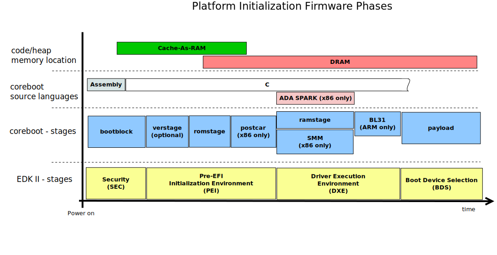
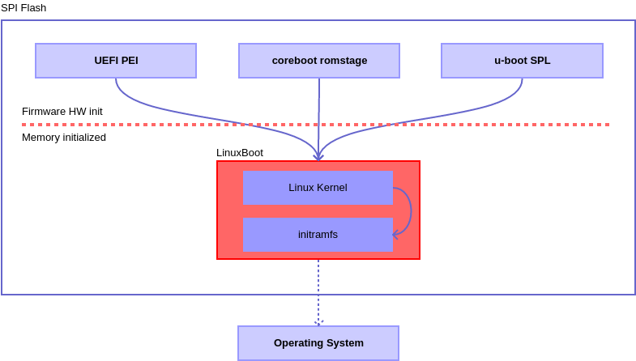
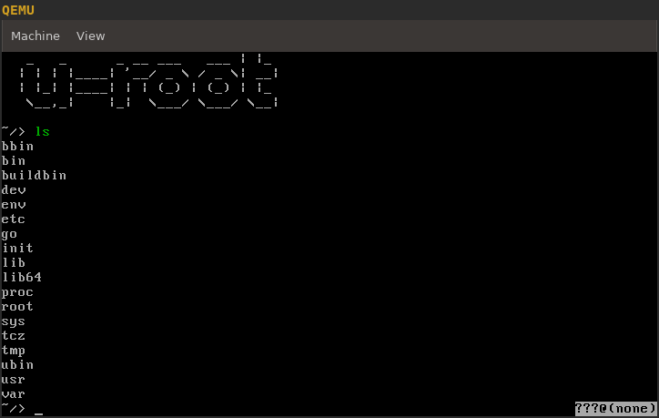

## Agenda

- Motivation
- LinuxBoot Concept
- UEFI Integration
- Implementations
- Future Work

# Motivation

## Firmware now vs back then

- 1999: birth of coreboot
  * open source firmware \\o/
- 2004: Tiano initial release by Intel
  * now EDK I/II, maintained by UEFI community
- 2014: Intel Haswell release
  * requires proprietary [MRC (Memory Reference Code) binary](https://doc.coreboot.org/northbridge/intel/haswell/mrc.bin.html)
  * later on: [FSP (Firmware Support Package)](https://www.intel.com/content/dam/www/public/us/en/documents/product-briefs/firmware-support-package-brief.pdf)
- 2014: AMD Generic Encapsulated Software Architecture (AGESA) lockdown
  * [binary only since then](https://mail.coreboot.org/pipermail/coreboot/2014-November/078892.html)
  * was initially open sourced for coreboot in early 2011
- 2019: [UDF (UEFI Dumpster Fire™)](https://twitter.com/xjamesmorris/status/1179825267939786752)
  * [criticized by many people](https://altelectron.org.uk/notice/9hJJFGA7fbQAAcQJWa)
  * [for many years](http://allsoftwaresucks.blogspot.com/2013/04/uefi-and-arm.html)

### neglected: Intel ME, AMD PSP, ARM and other SoCs

## Platform Initialization (PI)



### basic [platform initialization](https://www.cs.cmu.edu/~410/doc/minimal_boot.pdf): CPU, chipset, RAM (PEI / romstage)
- has to be rerun [similarly for S3 resume](https://reverse.put.as/2015/07/01/reversing-prince-harmings-kiss-of-death/)

# LinuxBoot Concept

## LinuxBoot

- Linux kernel + initramfs in SPI flash
- can run on top of
  * coreboot: as payload
  * U-Boot
  * vendor UEFI firmware: remove DXEs, build Linux with EFI support

\(=>\) approach rather than implementation

## Integrations



## Constraints

- only few megabytes of space (8 to 16 common)
- build minimum kernel
  * disk drivers
  * filesystems
  * possibly networking
- build basic initramfs
  * core utilities like `ls`, `cat`, etc
  * bootloader(s) - need to boot an OS ;)

\(=>\) very similar to OpenWrt, except for bootloader instead of routing tools

# UEFI Integration

## [UEFI binary format](https://wiki.osdev.org/UEFI#Binary_Format)

PE32 / PE32+ format, without symbol tables

Three types:

- applications
  * OS loaders
  * utilities
- boot service drivers
  * disk drivers
  * network drivers
- runtime drivers
  * may remain loaded while OS is running

\(=>\) replace applications and boot service drivers with LinuxBoot

# Implementations

## [u-root](https://u-root.tk/)

- initramfs tool written in Go
- utilities like busybox (`ls`, `cat`, ...)
- offers bootloaders (SystemBoot)

## Try out u-root in QEMU

```sh
go get github.com/u-root/u-root
# build an initramfs
~/go/bin/u-root -build=bb -o /tmp/initramfs.linux_amd64.cpio
# get a kernel
MIRROR="http://mirror.rackspace.com" REL="2019.10.01" \
  wget "$MIRROR/archlinux/iso/$REL/arch/boot/x86_64/vmlinuz"
# run it :)
qemu-system-x86_64 -kernel vmlinuz \
  -initrd /tmp/initramfs.linux_amd64.cpio
```

## u-root demo



## Heads
  * [authenticated / measured boot](https://trmm.net/Heads_threat_model)

# Future Work

##
