# Warning: Politics involved

## Agenda

- Introduction
- Motivation
- Projects
- Open Source Firmware Conference
- Future Work

# Introduction

## Firmware is everywhere

:::::::::::::: {.columns}
::: {.column width="55%"}
### Laptops

- BIOS/UEFI (host CPU)
- ME/PSP (coprocessor)
- Gigabit Ethernet (GbE)
- Embedded Controller (EC)

### Servers

- Baseboard Management Controller (BMC)

### Embedded devices

- System-on-Chip
:::
::: {.column width="45%"}
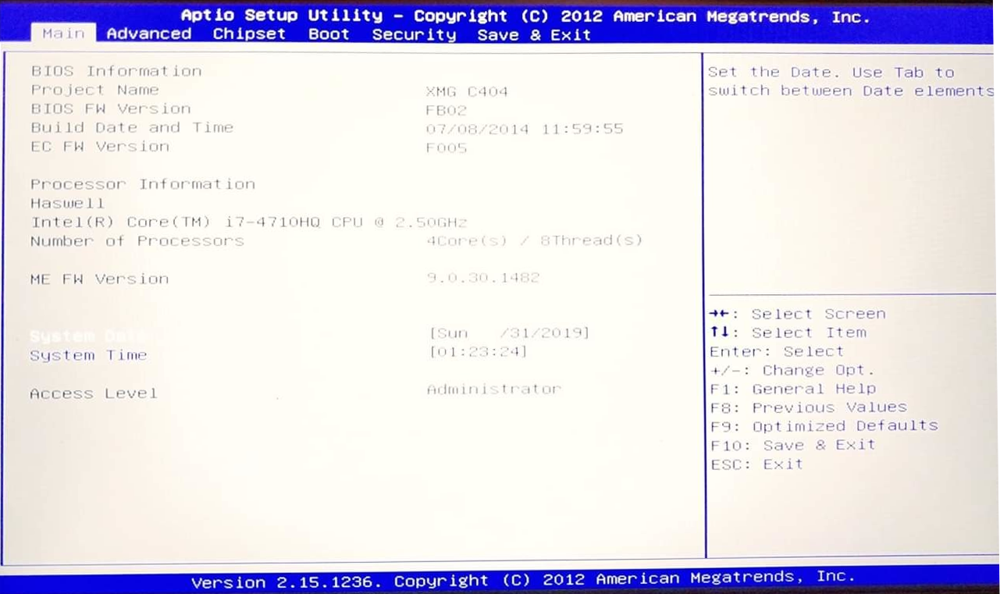{ height=40% }

{ height=40% }
:::
::::::::::::::

## What firmware does

- hardware initialization
  * specific to SoC, mainboard, some peripherals
- user interaction
  * UI, settings, boot selection
- OS interfacing
  * updates, feedback, power management

# Motivation

## Hardware supply chain

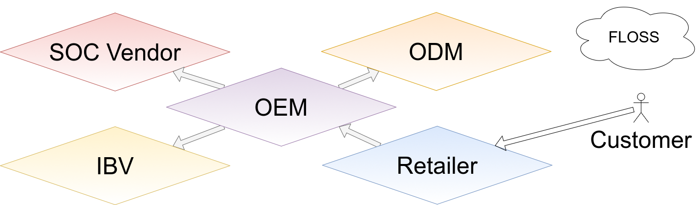

## Motivations to keep code proprietary

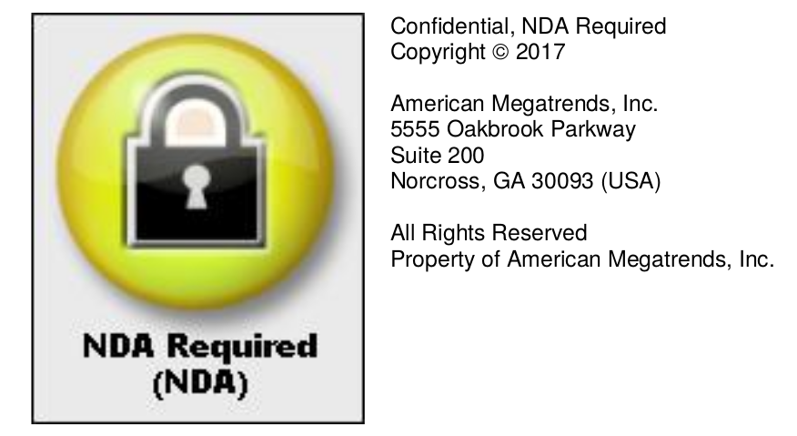

- intellectual property
- security by obscurity
- hiding quality issues

## Dexter's Law

> Only proprietary software vendors want proprietary software.

## Vendor perspective

> Intel is working towards releasing as much source code as possible going
> forward. A binary component is still the best way to encapsulate the complex
> solution that developers may not necessarily need to bother about as long as
> the binary component does its job right.

source: [FSP whitepaper](https://www.intel.com/content/dam/www/public/us/en/documents/white-papers/fsp-iot-royalty-free-firmware-solution-paper.pdf)

## Security

### Firmware, Kernel and the Rings on x86

- -3: ME
- -2: SMM / UEFI kernel
- -1: hypervisor
-  0: OS kernel
-  3: userspace

[Jessie Frazelle on Open Source Firmware](https://cacm.acm.org/magazines/2019/10/239673-open-source-firmware/fulltext)

[https://blog.jessfraz.com/post/why-open-source-firmware-is-important-for-security/](https://blog.jessfraz.com/post/why-open-source-firmware-is-important-for-security/)

## Fear

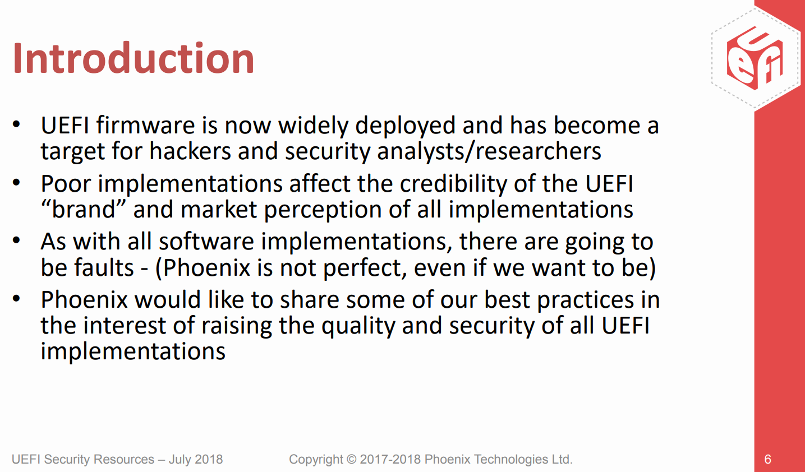{ height=80% }

source: [Phoenix](https://uefi.org/sites/default/files/resources/UEFI%20Firmware%20-%20Security%20Concerns%20and%20Best%20Practices.pdf)

## Issues

- consumers get very few updates
- some bugs are never fixed and require workarounds

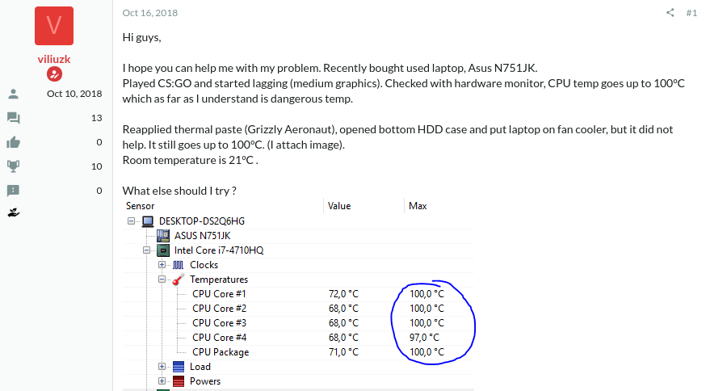{ height=70% }

# Projects

## (not only) x86

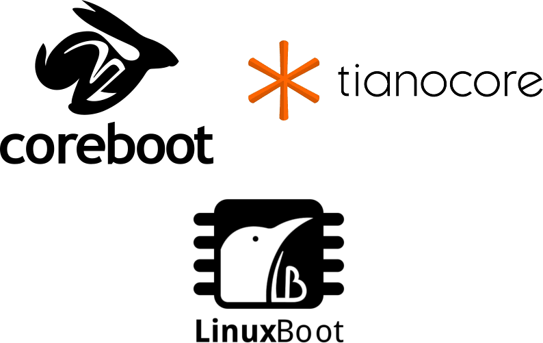{ width=100% }

## TianoCore

* reference implementation from Intel + community
* [EDK II/UDK](https://github.com/tianocore/tianocore.github.io/wiki/UDK) (EFI Development Kit II aka UEFI Development Kit)
* used by Independent BIOS Vendors (IBVs)
  * AMI: Aptio
  * Phoenix: SCT (SecureCore Technology™)
  * Insyde: H2O
* OVMF (Open Virtual Machine Firmware)
  * made for QEMU
  * debuggable through GDB using a bridge
* potential for secure boot on Linux
  * [draft from the Fedora Project](https://fedoraproject.org/wiki/Secureboot)
  * [ideas from James Bottomley](https://blog.hansenpartnership.com/uefi-secure-boot/)

## coreboot

* supports many boards and multiple architectures
* initializes hardware, then hands over to a payload
  * default: SeaBIOS
  * can directly boot a Linux kernel
* on Chromebooks by default and few other consumer devices
* full or almost full support for older Lenovo ThinkPads and HP EliteBooks
* more laptops are being added: Clevo, Razer, Gigabyte
* requires proprietary binaries for current x86 architectures
  * Intel: FSP (Firmware Support Package)
  * AMD: AGESA (AMD Generic Encapsulated Software Architecture)

# Let's see a demo! 💻

## [LinuxBoot](https://www.linuxboot.org/)

> Let Linux do it

* Linux kernel provides device drivers and networking
* initramfs with utilities, bootloader, whatever you wish
* approach rather than implementation
* can run on top of
  * coreboot: as payload
  * U-Boot
  * vendor UEFI firmware: remove DXEs, build Linux with EFI support

### Implementations

* [u-root](https://u-root.tk/)
  * written in Go
  * utilities like busybox
  * offers bootloaders
* Heads
  * [authenticated / measured boot](https://trmm.net/Heads_threat_model)

## Embedded Controller

- [Chromium OS EC](https://chromium.googlesource.com/chromiumos/platform/ec/+/master/README.md)
- [System76 EC](https://github.com/system76/ec)

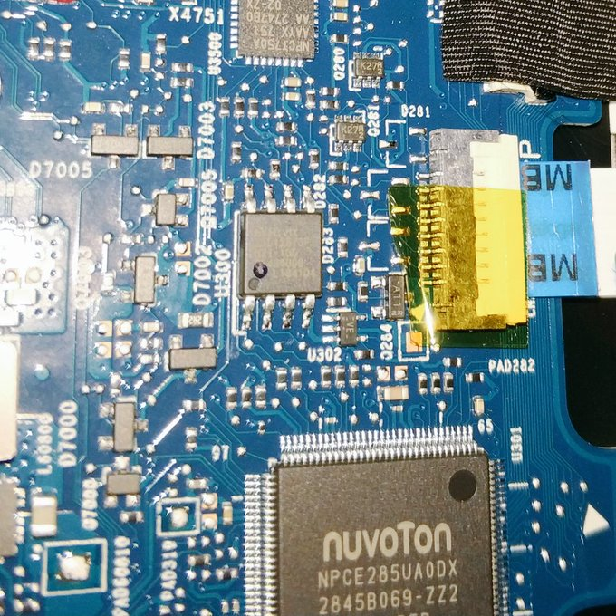{ height=60% }

## Baseboard Management Controller

- EDK2 [Redfish](https://www.dmtf.org/standards/redfish) POC
- OpenBMC
- u-bmc

+---------------+------------------------+--------------------+
| Project       | OpenBMC                | u-bmc              |
+===============+========================+====================+
| Languages     | C++, Python            | Go                 |
+---------------+------------------------+--------------------+
| Tooling       | Yocto, OpenEmbedded    | u-root             |
+---------------+------------------------+--------------------+
| Kernel        | OpenBMC Linux fork     | OpenBMC Linux fork |
+---------------+------------------------+--------------------+
| Init          | systemd                |                    |
+---------------+------------------------+--------------------+
| IPC           | D-Bus                  |                    |
+---------------+------------------------+--------------------+
| RPC           | IPMI, REST             | gRPC               |
+---------------+------------------------+--------------------+
| Metrics       |                        | OpenMetrics        |
+---------------+------------------------+--------------------+

# Open Source Firmware Conference

## OSFC 2018 in Erlangen, Germany

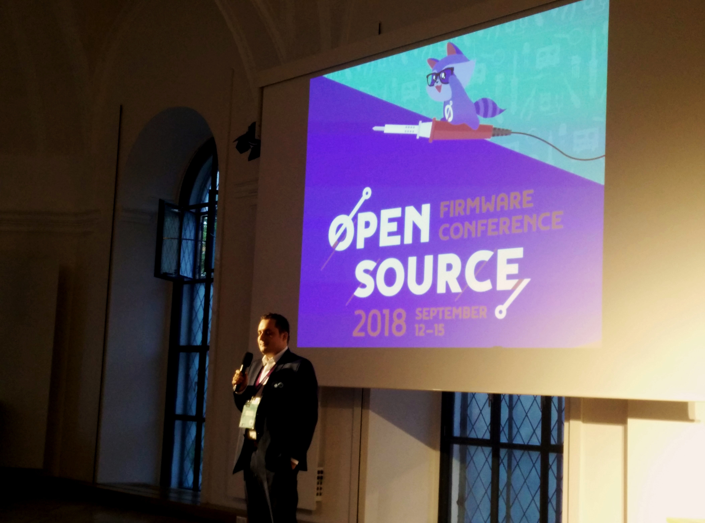{ height=60% }

- almost 200 participants
- 2 days of talks
  - 2 tracks (main + security)
- 2 days of workshops + hackathon

## OSFC 2019 in Silicon Valley, California

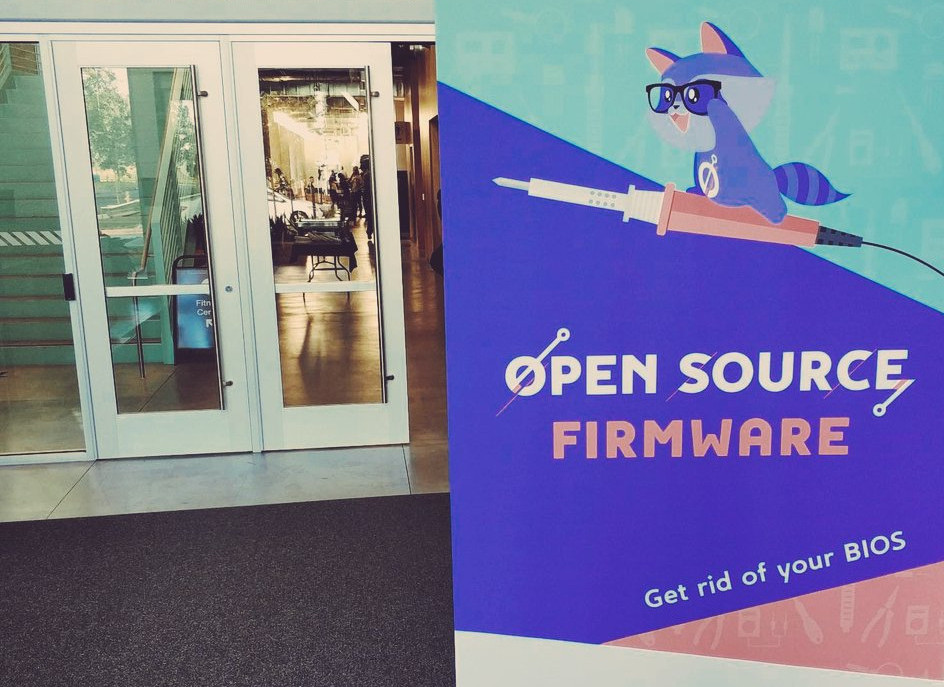{ height=60% }

- more than 250 participants
- 2 days of talks
  - 3 tracks (general, security, BMC)
- 2 days of lightning talks + hackathon

# Future Work

## Developers wanted

- [TUXEDO Computers is hiring coreboot developers](https://www.tuxedocomputers.com/en/Infos/Jobs/Software-Developers-for-Coreboot-BIOS-m/f/d.tuxedo)

{ width=15% }

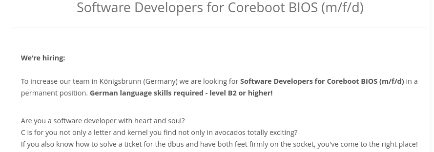{ width=95% }

## oreboot

- [introduced at OSFC 2019](https://osfc.io/uploads/talk/paper/23/Oreboot.pdf)
- downstream fork of coreboot
- implemented in Rust
- policy: no proprietary blobs, *absolutely*
- first targets
    * RISC ([HiFive Unleashed](https://github.com/oreboot/oreboot/blob/master/Documentation/sifive/setup.md))
    * QEMU (ARM)

{ width=20% }

## Redfish POC rearchitecture

[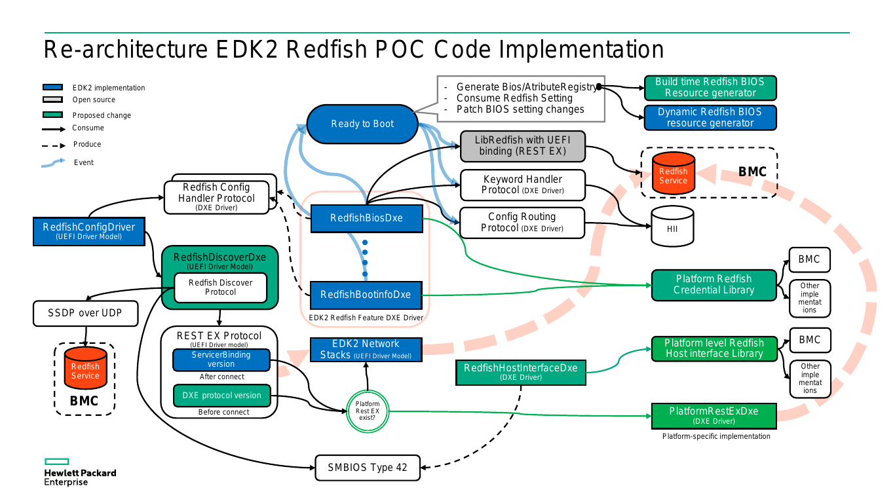{ height=70% }](https://github.com/tianocore/edk2-staging/raw/4adcaad64e1fae321e9dd68dd9cc3ec6f30405cf/Intel%20Redfish%20POC%20Code%20Rearchitecture.pdf)

## UEFI Forum public webinar

### How to create a secure development lifecycle for firmware*

- Wednesday, October 23 at 9:00 am PT
- Moderator: Brian Richardson (TBD)
- Panelists:
    * Dick Wilkins, Phoenix
    * Tim Lewis, Insyde Software
    * Eric Johnson, AMI

[https://uefi.org/node/4004](https://uefi.org/node/4004)

# Questions?

# Thanks! :)
