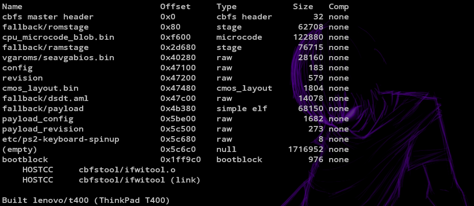
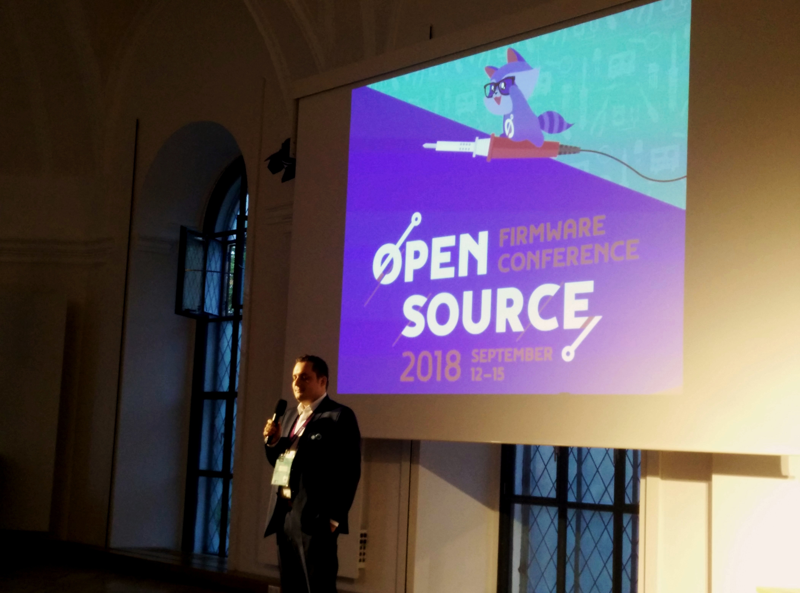
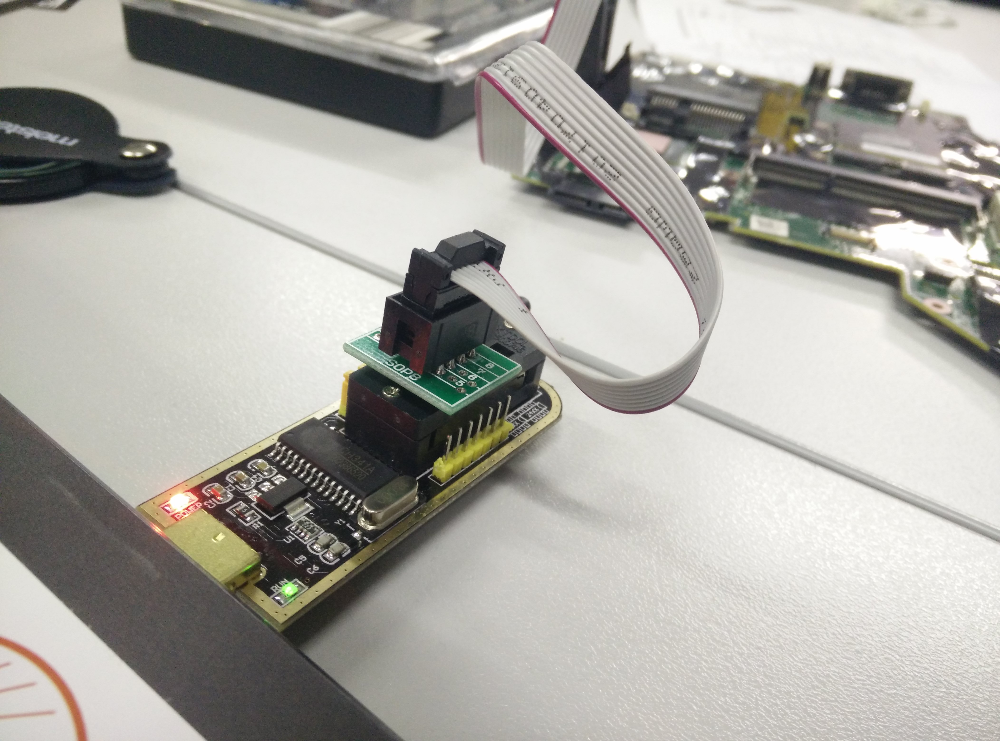
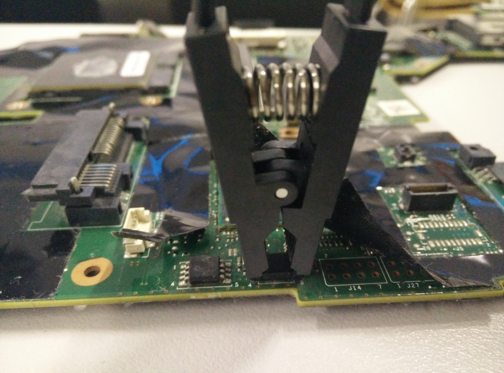

class: center, middle

# Open Source Firmware

 Daniel Maslowski |
 [@orangecms](https://twitter.com/orangecms) |
 [orangecms](https://github.com/orangecms)

---

## Table of Contents

1. What is firmware?
2. State of development
3. Soft equipment
4. Hardware equipment
5. x86 firmware (QEMU, Lenovo ThinkPad)
6. Xtensa lx106 firmware (ESP8266)

---

class: center, middle

## What is firmware?

---

### [Hardware, Firmware, Software](https://danielmiessler.com/blog/software-firmware-hardware/)


---

class: center, middle

## State of development

---

### x86

* vendor BIOS/UEFI
* plan: [replace x86 firmware](https://lwn.net/Articles/738649/)

--


* [coreboot](https://coreboot.org/) + [LinuxBoot](https://www.linuxboot.org/)

--



---

### Open Source Firmware Conference



---

class: center, middle

## Soft equipment

---

### [Toolchain](https://crosstool-ng.github.io/docs/toolchain-construction/)

1. GMP
2. MPFR
3. MPC
4. binutils
5. core pass 1 compiler
6. kernel headers
7. C library headers and start files
8. core pass 2 compiler
9. complete C library
10. final compiler

---

### SDK

* x86: [EDK II/UDK](https://github.com/tianocore/tianocore.github.io/wiki/UDK)
* ESP8266: [esp-open-sdk](https://github.com/pfalcon/esp-open-sdk)

---

### Flashing tool

* x86: [flashrom](https://flashrom.org/Flashrom) (SPI)
* ESP8266: [esptool](https://github.com/espressif/esptool) (USB)

---

### Binary inspection / editing tools

* ifdtool and other coreboot utilities
* [romdiver](https://github.com/coreboot-builder/romdiver)
* dd, cat
* disassembler, r2, etc
* [armor.ai platform](https://armor.ai/scan)

---

class: center, middle

## Hardware equipment

---

### Screwdrivers

---

### Magnifying lens

---

### Programmer



---

### Clip



---

class: center, middle

## x86 firmware (QEMU, Lenovo ThinkPad)

---

### TianoCore

--


* UEFI reference implementation from Intel

--


* OVMF (Open Virtual Machine Firmware)
  * made for QEMU
  * debuggable through GDB using a bridge

--


* potential for secure boot
  * [draft from the Fedora Project](https://fedoraproject.org/wiki/Secureboot)
  * [ideas from James Bottomley](https://blog.hansenpartnership.com/uefi-secure-boot/)

--


---

### coreboot


--


* on Chromebooks by default and few other consumer devices

--


* full or almost full support for some Lenovo ThinkPad devices

--


* default payload: SeaBIOS

--


* can run LinuxBoot as payload and replace boot loaders like GRUB

--


* since Firmware Support Package (FSP) licenses were changed, better portability

--


---

### building coreboot

1. read ROM from SPI flash
2. extract binaries through ifdtool
3. add binaries to coreboot sources and configure coreboot
4. build coreboot toolchain using host toolchain
5. build coreboot

--

```sh
#!/bin/sh

GCC_VER=6.3.0

# host toolchain, needed for SeaBIOS
export PATH="/usr/x86_64-pc-linux-gnu/gcc-bin/$GCC_VER:$PATH"
# old coreboot toolchain, the current one does not build coreboot with Ada
export PATH=/home/cyrevolt/firmware/coreboot/coreboot-4.8.1/util/crossgcc/xgcc/bin:$PATH
export ARCH=i386
export CROSS_COMPILE=i386-elf-

make -j4
```

--

6. flash coreboot :)

---

class: center, middle

## Xtensa lx106 firmware ([ESP8266](http://esp8266.net/))

---

### [NodeMCU](http://nodemcu.com/index_en.html)

* Lua interpreter
* [customizable prebuilt binaries](https://nodemcu-build.com/) available
* scripts can be put in a filesystem

---

### [MicroPython](http://micropython.org/)

* Python interpreter
* [prebuilt binaries](http://micropython.org/download#esp8266) available
* currently [experimental](https://github.com/micropython/micropython/blob/master/ports/esp8266/README.md)

---

class: center, middle

## Thanks, that's it! 🐢
