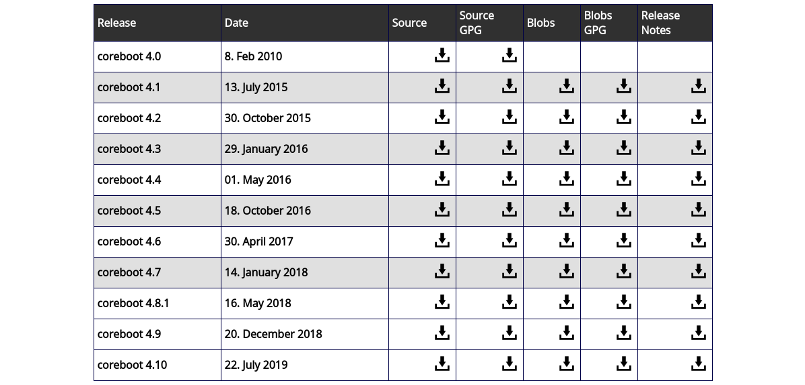

# Disclaimer: No shaming, no mocking!

## Agenda

- Introduction
- Motivation
- Inspecting Hardware
- Building Firmware
- User/Developer Experience

# Introduction

## Firmware is everywhere

:::::::::::::: {.columns}
::: {.column width="45%"}
{ height=40% }

### Embedded devices

- SoC
:::
::: {.column width="55%"}
{ height=40% }

### Laptops

- BIOS/UEFI (host CPU)
- ME (coprocessor)
- GbE
- EC
:::
::::::::::::::

## What Firmware Does

- hardware initialization
  * specific to SoC, mainboard, some peripherals
- user interaction
  * UI, settings, boot selection
- OS interfacing
  * updates, feedback, power management

## Open Source Firmware Origins

### 1994
- [IEEE 1275-1994](https://standards.ieee.org/standard/1275-1994.html)
- [Open Firmware](https://www.openfirmware.info/Welcome_to_OpenBIOS)
- [OpenBIOS](https://github.com/openbios/openbios)

### 1999
- Das U-Boot
- LinuxBIOS, later renamed to [coreboot](https://coreboot.org)

### 2004
- [TianoCore](https://www.tianocore.org/)

# Motivation

## Vendor Firmware

Vendor firmware may have [issues](https://lists.freebsd.org/pipermail/freebsd-acpi/2006-February/002571.html), but isn't fixed for various reasons.

{ width=85% }

## Recovery

Updates can brick an existing system, so [recovery options](http://hipstermag.blogspot.com/2015/11/how-i-fixed-my-dead-motherboard-bios.html) should be known.

{ width=85% }

## Malware

Malware can be [hidden in firmware](https://firmwaresecurity.com/2019/05/08/breaking-through-another-side-bypassing-firmware-security-boundaries-from-embedded-controller/), so it has to be auditable.

{ width=85% }

# Hardware Inspection

## System Block Diagram

{ width=85% }

## Embedded Controller Schematic

{ width=85% }

## Hardware Inspection Software Utilities

- igt-gpu-tools
- i2c-tools
- dmesg
- lspci
- acpidump (part of iasl, `util/acpi/acpidump-all` script in coreboot)
- dmidecode
- lstopo (part of hwloc) to list PCI device topology

### from [coreboot](https://coreboot.org/downloads):
- autoport (-make_logs uses tools below + lspci, acpidump, dmidecode)
- ectool
- inteltool
- superiotool

# Building Firmware

## Build Process
- toolchain for target architecture (x86, ARM, ...)
- firmware source code ;)

```sh
$ EDK_TOOLS_PATH=`pwd`/../BaseTools ./build.sh
Initializing workspace

...

FV Space Information
SECFV [10%Full] 212992 total, 22192 used, 190800 free
PEIFV [20%Full] 917504 total, 189992 used, 727512 free
DXEFV [36%Full] 11534336 total, 4216648 used, 7317688 free
FVMAIN_COMPACT [35%Full] 3440640 total, 1222080 used, 2218560 free

- Done -
```

# Recent Development

## Developers Wanted

- [TUXEDO Computers is hiring a coreboot developer](https://www.tuxedocomputers.com/en/Infos/Jobs/Software-Developers-for-Coreboot-BIOS-m/f/d.tuxedo)

{ width=15% }

{ width=95% }

## Thunderbolt

- [System76 makes open source Thunderbolt controller firmware](https://blog.system76.com/post/186655523269/open-firmware-and-more-news-from-july)
  * [USB4 based on Thunderbolt](https://www.anandtech.com/show/14048/usb4-specification-40-gbps-type-c-tb3)

{ width=75% }

## Privacy

- [Qubes OS certified Insurgo Privacy Beast X230](https://www.qubes-os.org/news/2019/07/18/insurgo-privacybeast-qubes-certification/)


## coreboot

- [coreboot 4.10 has been released](https://coreboot.org/downloads.html)



## Servers

- [9elements Cyber Security ported coreboot to modern server board](https://9esec.io/blog/first-modern-coreboot-server-platform/)

{ height=75% }

# User/Developer Experience

## Prebuilt Binaries

- easy peasy: [download, flash and run](https://chaospott.de/2019/08/08/coreboot.html)

{ height=85% }

## Emulation in QEMU

- easy peasy: [download, build and run](https://doc.coreboot.org/lessons/lesson1.html)

{ width=85% }

## Supported Devices

- easy peasy: download, build, flash and run

{ width=85% }

## Porting

- a lot of time, knowledge and effort required
- can be frustrating because of "intellectual property"
- luck and fortune help, and of course the coreboot IRC channel :)

{ width=80% }

# Announcement

## Open Source Firmware Conference 2019

- San Francisco
- [https://osfc.io](https://osfc.io)
- tracks: general, security, BMC


# Thanks! :)
