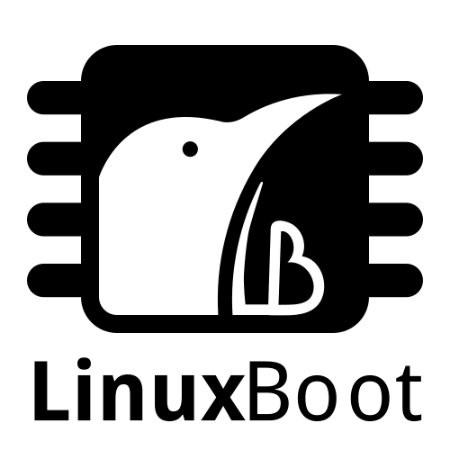

# Introduction

## Who I am

### Hi, I'm Daniel aka OrangeCMS aka CyReVolt! :)

:::::::::::::: {.columns}
::: {.column width="45%"}
- web developer
- security background
- hacking on many things
- just got started with firmware
- I like turtles

{ height=15% }
:::
::: {.column width="55%"}
{ height=60% }
:::
::::::::::::::

## Thank you!

{ height=40% }
{ height=40% }

## First Open Source Firmware Conference (OSFC) {.fragile}

:::::::::::::: {.columns}
::: {.column width="45%"}
- Erlangen, Germany
- ~200 participants
- 2 days of talks
  - 2 tracks (main + security)
- 2 days of workshops
- openSUSE was among the sponsors
:::
::: {.column width="55%"}
{ height=60% }
:::
::::::::::::::

# Firmware

## Firmware is everywhere

:::::::::::::: {.columns}
::: {.column width="45%"}
{ height=40% }

### Embedded devices

- SoC
:::
::: {.column width="55%"}
{ height=40% }

### Laptops

- BIOS/UEFI (host CPU)
- ME (coprocessor)
- GbE
- EC
:::
::::::::::::::

## Vendor Firmware

### fwupd/LVFS

{ height=25% }

- 114 [vendors listed](https://fwupd.org/lvfs/vendorlist)
- platform is growing and vendors push their updates

## Issues

- continuous updates are a requirement
- firmware updates depend on vendors
- vendors do not typically ship updates too often
- quality, updates may brick devices

[https://blog.scaleway.com/2018/a-look-from-behind-the-open-source-bios/](https://blog.scaleway.com/2018/a-look-from-behind-the-open-source-bios/)

# Vendors

## Supply Chain

## Politics

### Warning: may contain traces of blobs

- a lot of code and necessary knowledge is kept proprietary
  - documentation on ECs, Super I/O and other chips
  - board schematics
  - firmware for certain chips, FSP, VGA Option ROM, ...
- proprietary vendors implement UEFI, which is inherently complex

## Security

### Hardware attacks are increasing in research

{ height=10% }
{ height=10% }

- Rowhammer
- Spectre
- Meltdown

### Intel ME CVEs

[https://mjg59.dreamwidth.org/48429.html](https://mjg59.dreamwidth.org/48429.html)

## Firmware, Kernel and the Rings on x86

- -3: ME
- -2: SMM / UEFI kernel
- -1: hypervisor
-  0: kernel
-  3: userspace

[https://blog.jessfraz.com/post/why-open-source-firmware-is-important-for-security/](https://blog.jessfraz.com/post/why-open-source-firmware-is-important-for-security/)

# Open Source Firmware

## U-Boot

{ height=20% }

[https://www.denx.de/wiki/U-Boot](https://www.denx.de/wiki/U-Boot)

- supports multiple architectures
- more than 1000 boards
- powers many embedded devices, such as SBCs and routers
- initializes hardware
- can directly boot a Linux kernel
- can run multiple other payloads

## coreboot

{ height=20% }

[https://coreboot.org/](https://coreboot.org/)

- similar to U-Boot
  - supports many boards and multiple architectures
  - can directly boot a Linux kernel or run other payload
- ported to multiple older Thinkpads
- used for [Chromebooks by Google](https://www.chromium.org/chromium-os/chromiumos-design-docs/boot-design)
- now also applied to servers
- popular among hackers

## LinuxBoot

{ height=20% }

[https://www.linuxboot.org/](https://www.linuxboot.org/)

- announced in January 2018
- remove overhead from bootloaders
- Linux provides device drivers and networking
- can be run from UEFI, U-Boot, or coreboot

[https://www.phoronix.com/scan.php?page=news_item&px=LinuxBoot-OSFC-2018-State](https://www.phoronix.com/scan.php?page=news_item&px=LinuxBoot-OSFC-2018-State)

# Equipment

## Screwdrivers

{ height=70% }

## Magnifying Lens

{ height=70% }

## Test Clip

{ height=70% }

## Programmer

{ height=70% }

## Tooling

- host toolchain
- project toolchain
- extra utilities for creating images etc
- flash utilities, e.g., flashrom

# Start hacking

## coreboot / QEMU

### Build your first image and run it in an emulator

{ height=60% }

## Disassemble all the Devices!

{ height=70% }

## XMG C404 (Gigabyte P34v2) coreboot port (WIP)

:::::::::::::: {.columns}
::: {.column width="45%"}
{ height=60% }
:::
::: {.column width="55%"}
### Works
- RAM
- Video (blob only)
- keyboard and touchpad
- Bluetooth
- WiFi
- USB
- suspend / resume

### Needs work
- Embedded Controller (runs hot)
- ACPI (lid close doesn't trigger S3)
:::
::::::::::::::

[https://github.com/orangecms/coreboot/tree/gigabyte-p34v2](https://github.com/orangecms/coreboot/tree/gigabyte-p34v2)

[https://gist.github.com/orangecms/b6a8f036a30b7ac3b42c30c35fa295b4](https://gist.github.com/orangecms/b6a8f036a30b7ac3b42c30c35fa295b4)

# Call for Action

## Get OEMs on Board

{ height=15% }
{ height=15% }
{ height=15% }

[https://www.tuxedocomputers.com/](https://www.tuxedocomputers.com/)

[https://www.schenker-tech.de/](https://www.schenker-tech.de/)

[https://www.xmg.gg/](https://www.xmg.gg/)

## Integrate Firmware Upgrades in OS Distros

- zypper up firmware
- build firmware in OBS
- run checks on openQA
- bring kernel and firmware development closely together
- join the Open Source Firmware community

# And now...

## Happy Anniversaries!

- U-Boot and coreboot both turn 20 this year

{ height=40% }
{ height=40% }

## Invitation

### Join OSFC 2019 in San Francisco!

- [https://osfc.io/](https://osfc.io/)

# Thanks again!

## Invitation Number 2

:::::::::::::: {.columns}
::: {.column width="55%"}
### Meet 9elements Cyber Security at it-sa!

- [https://security.9elements.com/](https://security.9elements.com/)
- [https://www.it-sa.de](https://www.it-sa.de)

{ height=24% }
{ height=20% }
:::
::: {.column width="45%"}
{ height=50% }
:::
::::::::::::::
