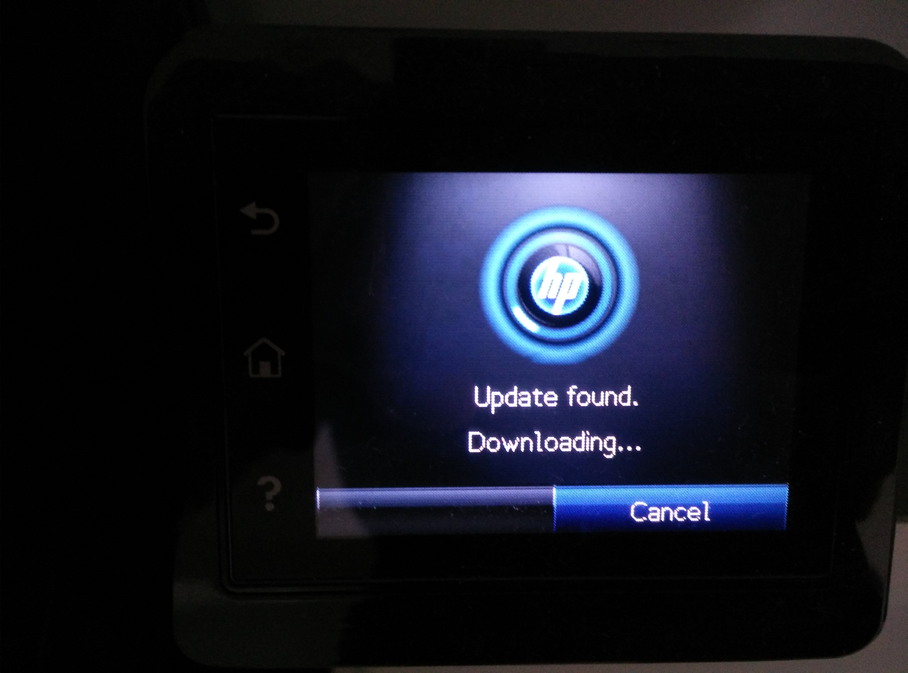

# Introduction

## Firmware is everywhere

:::::::::::::: {.columns}
::: {.column width="45%"}
{ height=40% }

### Embedded devices

- SoC
:::
::: {.column width="55%"}
{ height=40% }

### Laptops

- BIOS/UEFI (host CPU)
- ME (coprocessor)
- GbE
- EC
:::
::::::::::::::

## What Firmware Does

- hardware initialization
- user interaction
- OS interaction

# Motivation

## Vendor Firmware

Vendor firmware may have [issues](https://lists.freebsd.org/pipermail/freebsd-acpi/2006-February/002571.html), but isn't fixed for various reasons.

{ width=85% }

## Recovery

Updates can brick an existing system, so [recovery options](http://hipstermag.blogspot.com/2015/11/how-i-fixed-my-dead-motherboard-bios.html) should be known.

{ height=85% }

## Malware

Malware can be [hidden in firmware](https://firmwaresecurity.com/2019/05/08/breaking-through-another-side-bypassing-firmware-security-boundaries-from-embedded-controller/), so it has to be auditable.

{ width=85% }

# Open Source Firmware

Sun, SPARC, PPC, x86
https://www.openfirmware.info/Welcome_to_OpenBIOS
https://github.com/openbios/openbios

## Boot Process

state machine: coreboot `src/include/bootstate.h`

# Hardware

## System Block Diagram

{ width=85% }


## Embedded Controller Schematic

{ width=85% }

## Building Firmware

- toolchain for target architecture (x86, ARM, ...)
- firmware source code ;)

```sh
$ EDK_TOOLS_PATH=`pwd`/../BaseTools ./build.sh
Initializing workspace
/home/cyrevolt/firmware/EDKII/edk2-edk2-stable201903/BaseTools
Loading previous configuration from /home/cyrevolt/firmware/EDKII/edk2-edk2-stable201903/Conf/BuildEnv.sh
WORKSPACE: /home/cyrevolt/firmware/EDKII/edk2-edk2-stable201903
EDK_TOOLS_PATH: /home/cyrevolt/firmware/EDKII/edk2-edk2-stable201903/BaseTools
CONF_PATH: /home/cyrevolt/firmware/EDKII/edk2-edk2-stable201903/Conf
using prebuilt tools
Running edk2 build for OvmfPkgX64
Build environment: Linux-4.19.44-gentoo-9e-x86_64-Intel-R-_Core-TM-_i7-7500U_CPU_@_2.70GHz-with-gentoo-2.6
Build start time: 08:38:33, Aug.10 2019

...

FV Space Information
SECFV [10%Full] 212992 total, 22192 used, 190800 free
PEIFV [20%Full] 917504 total, 189992 used, 727512 free
DXEFV [36%Full] 11534336 total, 4216648 used, 7317688 free
FVMAIN_COMPACT [35%Full] 3440640 total, 1222080 used, 2218560 free

- Done -
Build end time: 08:38:48, Aug.10 2019
```

## Hardware Inspection Utilities

- igt-gpu-tools
- i2c-tools
- dmesg
- lspci
- acpidump (part of iasl, `util/acpi/acpidump-all` script in coreboot)
- dmidecode
- lstopo (part of hwloc) to list PCI device topology

### from [coreboot](https://coreboot.org/downloads):
- autoport (-make_logs uses tools below + lspci, acpidump, dmidecode)
- ectool
- inteltool
- superiotool

## Binary Extraction/Inspection/Manipulation Utilities

- ifdtool: [coreboot](https://coreboot.org/downloads) `utils/ifdtool`

- xxd


## current news
- System76 has open source Thunderbolt controller firmware -> USB4
  https://blog.system76.com/post/186655523269/open-firmware-and-more-news-from-july
  https://www.anandtech.com/show/14048/usb4-specification-40-gbps-type-c-tb3
- LVFS growing: Lenovo publishes Thunderbolt controller updates
  https://twitter.com/hughsient/status/1158660163634679808
- LinuxBoot kexec to Windows
  https://twitter.com/hugelgupf/status/1158466881373630464
- TUXEDO Computers hiring coreboot developer
  https://www.tuxedocomputers.com/en/Infos/Jobs/Software-Developers-for-Coreboot-BIOS-m/f/d.tuxedo
- 9eSec ported modern coreboot to server board
  https://9esec.io/blog/first-modern-coreboot-server-platform/
- Qubes OS certified Insurgo Privacy Beast X230
  https://www.qubes-os.org/news/2019/07/18/insurgo-privacybeast-qubes-certification/
- coreboot 4.10 has been released
  https://coreboot.org/downloads.html
- Google adding EPYC to Google Cloud
  https://cloud.google.com/blog/products/compute/amd-epyc-processors-come-to-google-and-to-google-cloud
